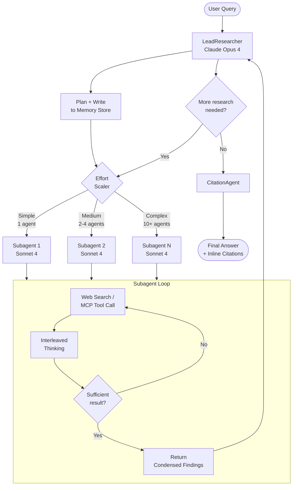
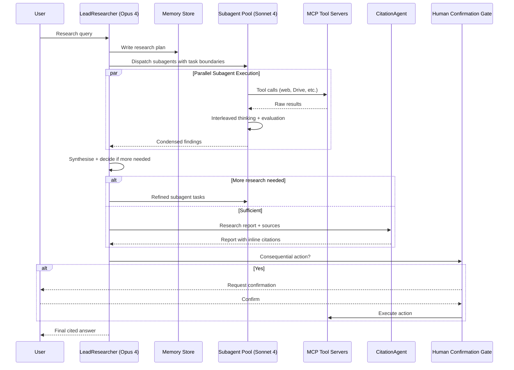

> *This analysis is based on public engineering blog posts, conference talks, patent filings, and observable system behaviour. It is not official documentation from the company.*

## System Context

Anthropic's **Research** feature — shipped in 2025 as a capability within Claude.ai — is a multi-agent system that accepts open-ended research queries, decomposes them into parallel subtasks, and synthesises cited answers from across the web and connected workspaces (Google Drive, Gmail, Calendar via MCP). It targets complex, breadth-first queries that cannot be adequately handled by a single-pass retrieval pipeline: competitive landscape analysis, technical due diligence, multi-source synthesis across dozens of primary documents.

The system runs on a two-tier model configuration: Claude Opus 4 serves as the **LeadResearcher** (orchestrator), Claude Sonnet 4 serves as **Subagents** (parallel workers). A lightweight third agent, the **CitationAgent**, handles final attribution. Anthropic's own internal evaluation showed the multi-agent configuration outperformed single-agent Claude Opus 4 by **90.2%** on their research benchmark — driven primarily by the ability to fan work out across separate context windows rather than any model capability difference per se.

The system operates under Anthropic's broader safety framework, which mandates minimal footprint, preference for reversible actions, and human-confirmation steps for consequential operations. This is not merely guidance — it shapes the tool design, the MCP permission model, and the prompting strategy throughout.

The core engineering constraint is that multi-agent systems burn tokens far faster than single-agent ones. Anthropic's own measurements found agents use approximately **4× more tokens than chat interactions**, and multi-agent configurations approximately **15× more**. Economic viability therefore depends on the value of the task being high enough to absorb that cost — and on aggressive context management to prevent runaway context bloat as subagent results flow back to the lead agent.

## The Engineering Problem

Without deliberate architecture choices, a naive multi-agent research pipeline fails in predictable ways:

- **Coordination collapse** — Without explicit delegation protocols, subagents duplicate effort, leave task gaps, or pursue the same queries in different phrasings. Early versions spawned up to 50 subagents for simple queries and allowed agents to "distract each other with excessive updates."
- **Context blowout** — The lead agent's context window fills up rapidly as it receives reports from multiple subagents. Without compaction, the window exceeds the 200k token limit mid-task and critical plan state is silently lost.
- **Effort misallocation** — Agents struggle to judge appropriate effort: simple fact-finding queries received the same resource allocation as multi-source synthesis tasks. Overinvestment on simple queries was the most common early failure mode.
- **Tool selection drift** — With MCP servers exposing many tools of varying quality, agents default to generic web search even when a specialised tool (e.g., a Drive search for internal documents) is strictly correct. Bad tool descriptions send agents down expensive wrong paths.
- **Citation gap** — Synthesis and citation attribution are in tension: a model generating a flowing answer tends to drop inline citations or misattribute them. Treating citation as an afterthought produces answers that look authoritative but are not verifiable.

## Pattern Stack

| Pattern | Role in This System |
|---|---|
| Multi-Agent Orchestration | LeadResearcher (Opus 4) decomposes queries and delegates to parallel Subagents (Sonnet 4); results flow back up for synthesis. Covers orchestrator-worker coordination, parallel subagent fan-out, and specialized citation agent responsibilities |
| Context Compaction | LeadResearcher writes its plan to a persistent Memory store at the start; summaries from Subagents replace raw tool output, preventing window overflow |
| Effort Scaling | Prompt-embedded rules map query complexity to a prescribed agent count and tool-call budget (1 agent / 3–10 calls up to 10+ agents / open-ended) |
| Human-in-the-Loop | Agents pause and request confirmation before consequential, irreversible actions; Anthropic's safety framework mandates this at the infrastructure level |
| Span-Level Tracing | Every research run emits spans covering agent interactions, tool calls, and compaction events for debugging and optimization |

## Architecture Walkthrough

1. **Query ingestion and planning** — The LeadResearcher receives the user query and begins with interleaved thinking to develop a research strategy. Critically, it writes this plan to a persistent Memory store before dispatching any subagents. If the context window is later truncated (it operates near a 200k token ceiling), the plan survives in external state rather than being silently lost mid-task.

2. **Effort scaling** — A set of prompt-embedded rules translates query complexity into a subagent budget. Simple fact-finding uses a single agent with 3–10 tool calls. Direct comparisons use 2–4 subagents with 10–15 tool calls each. Complex synthesis can spawn more than 10 subagents with clearly divided scopes. This calibration emerged from observing that unconstrained agents overinvested on simple queries — a surprisingly expensive failure mode at scale.

3. **Subagent dispatch with explicit task boundaries** — Each subagent receives a detailed task description specifying: objective, expected output format, which tools and sources to use, and explicit task boundaries that prevent overlap with sibling subagents. Vague instructions like "research the semiconductor shortage" caused early agents to duplicate queries; explicit boundary specification ("focus on post-2023 TSMC capacity announcements, not automotive demand context") resolves this.

4. **Subagent execution with interleaved thinking** — Each subagent runs its own tool-call loop independently. It has access to web search, MCP-connected data sources, and specialised tools. Subagents use **interleaved thinking** — alternating explicit reasoning steps with tool calls — to evaluate results and decide whether to continue searching or return findings. Each subagent's context window is isolated, enabling true parallelism.

5. **Result condensation and return** — Subagents return condensed findings, not raw tool output. This compression step is architecturally deliberate: the subagent's context window serves as a working space that distils many search results into the most important tokens, then passes only those tokens back to the LeadResearcher. Without this condensation step, the lead agent's context fills with raw HTML and redundant snippets.

6. **Synthesis and iteration decision** — The LeadResearcher synthesises subagent findings and decides whether the research is complete. If gaps remain, it spawns another round of subagents with refined task descriptions. This iterative loop continues until the lead agent judges the information sufficient — a judgement guided by explicit prompts about when to stop.

7. **Citation resolution** — On exit from the research loop, the CitationAgent receives the full research report and all source documents. Its sole responsibility is to identify specific locations within source material that support each claim in the report, inserting inline citation references. Separating citation from synthesis prevents the synthesis model from dropping or misattributing sources when focused on generating coherent prose.

8. **Human-in-the-loop gates** — Before any consequential action (sending an email via Gmail MCP, deleting a document, writing to an external system), the agent pauses and requests explicit user confirmation. This is enforced at the infrastructure level by Anthropic's agent safety framework — not left to model discretion. The MCP permission model also supports one-time vs. permanent access grants, giving users granular control over what tools remain active across sessions.

### Trust Hierarchy and MCP Permission Model

Claude's agent architecture encodes a layered trust model that distinguishes three principal levels:

| Principal | Trust Level | Scope of Influence |
|---|---|---|
| Anthropic (via training) | Highest | Constitutional constraints on model behaviour; cannot be overridden by operators or users |
| Operator (system prompt) | Medium | Tool availability, connector permissions, safety guardrail tuning; enterprise admins control which MCP servers users may access |
| User | Lower (elevated with confirmation) | Task-level delegation; consequential actions require explicit user confirmation regardless of operator settings |

MCP servers implement this at the tool level: each server exposes a scoped set of capabilities, and the host application mediates which tools are presented to the model. This scoping is a deliberate security surface — preventing a compromised MCP tool from accessing resources beyond its declared scope.

## Pattern Interaction Notes

**The effort scaler is the primary cost control, not model routing.** Unlike Perplexity's model router, which switches between model classes, Claude's Research system uses the same Sonnet 4 model for all subagents. Cost is controlled by limiting how many subagents spawn and how many tool calls each makes. This means the effort scaler must be calibrated carefully — too conservative and complex queries are underserved; too liberal and a simple factual query spawns 10 subagents.

**Context compaction is what makes iterative research viable.** Without the Memory store write at the start, and without subagent condensation on return, the LeadResearcher's context window would be exhausted within one or two research rounds. The compaction pattern converts the problem from "how many sources can we read" to "how well can we compress findings" — a tractable problem for capable language models.

**Separation of synthesis and citation is a quality gate, not a latency cost.** Running a dedicated CitationAgent adds latency. The design choice reflects a recognition that synthesis models optimise for coherent prose and tend to drop citations when context is complex. Making citation a specialised post-pass — with a model that has only one job — produces reliably attributed output.

**MCP scoping and the trust hierarchy are structurally linked.** The minimal footprint principle (request only necessary permissions, prefer reversible actions) is encoded in MCP's connector architecture. This is not prompt engineering — it is the permission model itself that constrains what tools a given agent can call. If the trust hierarchy were implemented only in prompts, a sufficiently capable model reasoning about its task might override it. Structural enforcement makes it robust.

**Token economics set an implicit floor on task value.** At 15× the token cost of a chat interaction, multi-agent Research is only viable for queries where the answer justifies the price. This shapes product positioning: Research is not a general search replacement. It is positioned for tasks where users would otherwise spend hours doing the research themselves — a value threshold that makes the economics work.

## Inferred Implementation Details

**Subagent condensation is implemented at the prompt level, not the infrastructure level.** Subagents are instructed to return "condensed findings" rather than raw tool output. The compression quality depends on the model's summarisation capability — which is why Sonnet 4, rather than a smaller model, is used for subagents despite its higher cost.

> Source: Anthropic Engineering Blog, "How we built our multi-agent research system," June 2025

**The 90.2% outperformance over single-agent Opus is driven by token parallelism, not model superiority.** Three variables explain 95% of performance variance on BrowseComp: token usage (80%), tool call count, and model choice. Multi-agent architectures increase effective token budget by distributing across isolated context windows — the primary mechanism, not model intelligence.

> Source: Anthropic Engineering Blog, June 2025; BrowseComp evaluation analysis

**Effort scaling thresholds are prompt-embedded, not learned.** The rules mapping query complexity to subagent count are explicit prompt instructions, not a learned classifier. This reflects a preference for interpretable, debuggable behaviour over learned routing that can drift silently.

> Source: Anthropic Engineering Blog, June 2025

**MCP one-time vs. permanent access grants are user-level controls, not operator defaults.** A user can grant a connector access for the current task only. Enterprise admins can restrict which connectors are available to users in their organisation, but cannot grant access beyond what the user has authorised for a given session.

> Source: Anthropic, "Our framework for developing safe and trustworthy agents," August 2025

**The agent loop uses stop_reason as a continuation signal, not output parsing.** The agentic loop continues as long as the model returns `stop_reason: "tool_use"` and terminates on `stop_reason: "end_turn"`. Parsing natural language output to decide whether to continue the loop — a common anti-pattern — is explicitly avoided.

> Source: Claude Certified Architect documentation, 2025

**Consequential action confirmation is not modelled as a tool call.** The human-in-the-loop gate is an infrastructure-level pause, not a tool the model decides to call. This prevents a model reasoning "this is important enough to skip confirmation" from bypassing the gate.

> Source: Inferred from Anthropic safety framework documentation; consistent with MCP permission model design

## Lessons for Practitioners

- **Write plan state to external memory before spawning subagents.** If the orchestrator's context window fills during a long research task, the plan is the highest-value content to preserve. Write it out first, not last.
- **Task boundaries are the primary coordination mechanism.** Vague delegations produce redundant work. Explicit non-overlap specifications ("focus on X, not Y") are more reliable than hoping agents self-organise.
- **Scale effort in discrete tiers, not continuously.** Continuous effort scaling requires a classifier that can be wrong at any value. Discrete tiers (simple / medium / complex) with embedded prompt rules are more debuggable and produce more predictable cost profiles.
- **Separate citation from synthesis.** A model trying to simultaneously write coherent prose and maintain citation accuracy will trade off one against the other. A dedicated citation pass after synthesis produces reliably attributed output.
- **Structural permission enforcement outperforms prompt-based enforcement.** The minimal footprint principle only holds under adversarial conditions if it is encoded in the permission model, not just in the system prompt. Design your MCP scopes so that the model cannot exceed them regardless of its reasoning.
- **Token parallelism is the core multi-agent benefit.** The gain from multi-agent systems is primarily that you can run more tokens in parallel, not that agents are smarter than single models. Design your task decomposition to maximise parallelism and minimise inter-agent dependencies.
- **Multi-agent economics require a minimum task value threshold.** At 15× chat token costs, multi-agent Research only makes sense for high-value tasks. Clarify the value threshold before architecting a multi-agent solution, or you will build an expensive system for queries that a single-pass RAG pipeline would have answered adequately.

## What This Analysis Cannot Tell You

- **Exact compaction trigger thresholds** — The specific token counts or message counts that trigger context compaction in production are not publicly documented
- **MCP server implementation details** — How MCP servers are sandboxed, what resource limits they enforce, and how tool schemas are validated remain proprietary
- **Citation agent accuracy metrics** — How often citations are correctly attributed, what percentage of claims receive inline sources, and how citation quality is measured
- **Cost per query breakdown** — Actual token costs, API call costs, and infrastructure costs for different query complexity tiers
- **Subagent condensation quality** — What compression ratio subagents achieve, how much information is lost in condensation, and what quality controls exist
- **Failure recovery mechanisms** — How the system handles subagent failures, tool timeouts, or context overflow despite compaction
- **Model version specifics** — Exact training details of Opus 4 vs Sonnet 4, fine-tuning for research tasks, and model selection criteria beyond cost

## References

1. [How we built our multi-agent research system — Anthropic Engineering Blog, June 2025](https://www.anthropic.com/engineering/multi-agent-research-system)
2. [Our framework for developing safe and trustworthy agents — Anthropic, August 2025](https://www.anthropic.com/news/our-framework-for-developing-safe-and-trustworthy-agents)
3. [Introducing the Model Context Protocol — Anthropic, November 2024](https://www.anthropic.com/news/model-context-protocol)
4. [BrowseComp Evaluation — OpenAI, 2025](https://openai.com/index/browsecomp/)
5. [Dive into Claude Code: The Design Space of Today's and Future AI Agent Systems — arXiv, April 2026](https://arxiv.org/html/2604.14228v1)
6. [How we contain Claude across products — Anthropic Engineering, 2026](https://www.anthropic.com/engineering/how-we-contain-claude)