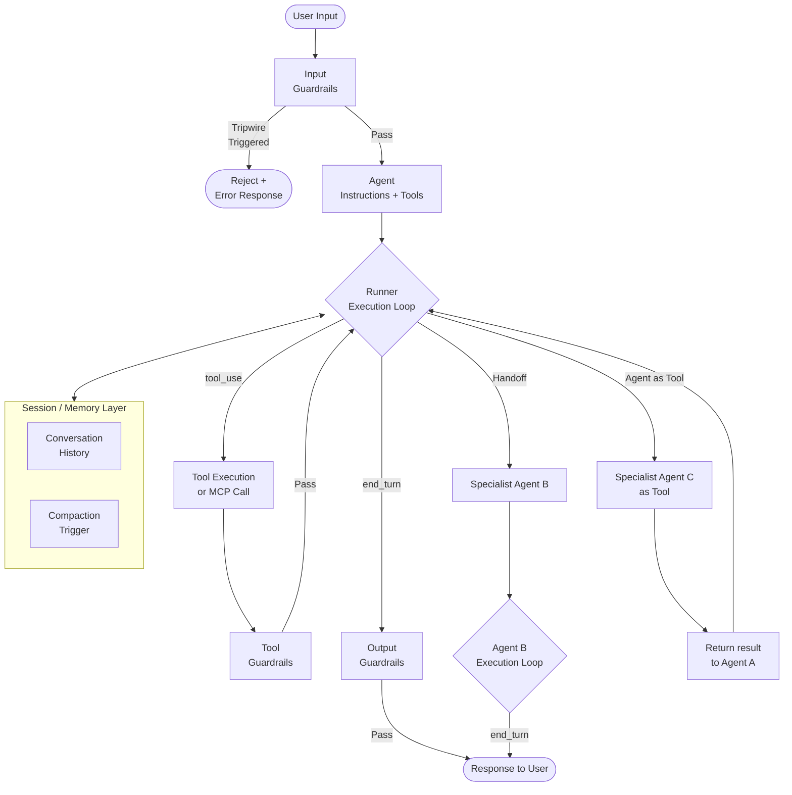
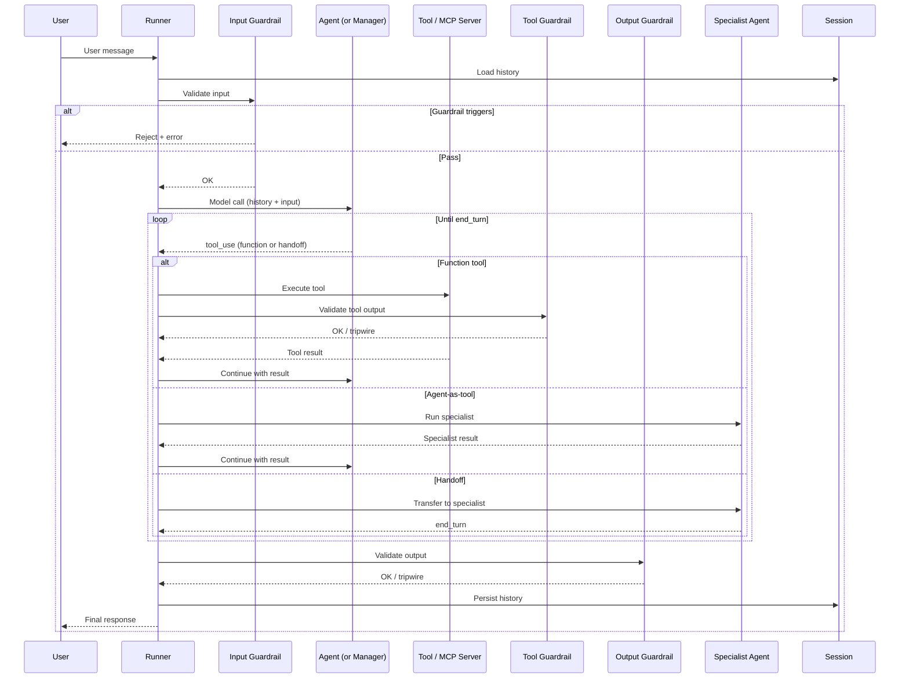

> *This analysis is based on public engineering blog posts, conference talks, patent filings, and observable system behaviour. It is not official documentation from the company.*

## System Context

OpenAI's **Agents SDK** — released in March 2025 as the production successor to the experimental Swarm project — is an open-source framework (MIT licence) for building multi-agent systems on top of the Responses API. As of May 2026, the GitHub repository has accumulated 26,400+ stars and 4,000+ forks, making it the most-adopted first-party agent framework from any major AI lab.

The SDK's design philosophy is explicitly minimalist: four core primitives (Agents, Tools, Handoffs, Guardrails) handle the vast majority of real-world orchestration patterns without requiring developers to pre-define state machines, graphs, or typed edges. This is a deliberate contrast to frameworks like LangGraph, which expose rich graph structures at the cost of cognitive overhead. The SDK's stated goal is to let developers "focus on business logic rather than orchestration complexity."

The SDK is backed by the **Responses API**, which replaced the Chat Completions API as OpenAI's primary interface for tool-using agents. The Responses API provides server-managed state through `previous_response_id` chaining, and the SDK layers **Session** objects on top of this to provide automatic context management across turns without manual history tracking. A higher-level toolkit, **AgentKit**, was announced at DevDay October 2025, adding Agent Builder, ChatKit, Connector Registry, and evaluation loops for teams that want to move faster than the raw SDK allows.

The SDK is provider-agnostic despite being optimised for OpenAI models: it works with any Chat Completions-compatible endpoint, meaning Azure OpenAI, Ollama, vLLM, and third-party providers with compatible APIs can be substituted without changing orchestration code. This was a direct response to developer concerns about vendor lock-in.

The primary engineering constraint is that the SDK must remain simple enough to be productive in minutes while flexible enough to support production patterns such as parallel validation, long-horizon sandbox execution, realtime voice agents, and fine-grained tracing. It achieves this through opinionated defaults with well-documented escape hatches to the raw Responses API.

## The Engineering Problem

Without a structured framework, production multi-agent systems built on raw API calls fail in predictable ways:

- **Manual loop management** — Developers must implement the tool-call → execute → respond cycle themselves, handling edge cases around multi-step tool chains, errors, and partial results. Each implementation is bespoke and untested at scale.
- **Routing spaghetti** — Without a formal handoff mechanism, agent-to-agent delegation is implemented as application logic scattered across route handlers and conditional branches. When something goes wrong, the routing decision is invisible.
- **Input/output contamination** — Without structured validation running before and after agent calls, malformed inputs reach models and unsafe or malformed outputs reach users. Adding validation as an afterthought requires retrofitting every agent boundary.
- **Context accumulation costs** — Without automated session management, conversation history grows unbounded across turns. Developers manually track `previous_response_id` or append output arrays, leading to inconsistent context window management and escalating token costs.
- **Invisible failures** — Without built-in tracing, a failure in a multi-step agent run shows up as a single error in application logs with no visibility into which tool call, which agent turn, or which guardrail caused it.
- **Long-horizon brittleness** — Agents that need to work on files, code, or data across many turns have no isolated workspace. State leaks between runs, or agents overwrite files generated by sibling agents.

## Pattern Stack

| Pattern | Role in This System |
|---|---|
| Multi-Agent Orchestration | Implements two coordination patterns: Handoff (decentralized control transfer to specialists) and Manager-as-Tool (centralized control where specialists return results). Orchestrator manages delegation and result synthesis. |
| Guardrails | Input guardrails run before the agent receives queries; output guardrails run after model responses; tool guardrails fire on every function invocation. All run in parallel to minimize latency while catching violations. |
| Context Compaction | Session objects manage conversation history automatically; `OpenAIResponsesCompactionSession` compresses history when item count exceeds a threshold, replacing detailed history with structured summaries. |
| Span-Level Tracing | Every agent run emits spans covering model calls, tool executions, handoffs, and guardrail evaluations. Traces integrate with OpenAI's evaluation, fine-tuning, and distillation tooling without additional instrumentation. |
| Circuit Breaker for LLMs | Protects against cascading failures when tools or models timeout; SDK implements graceful degradation and retry logic to prevent agent loops from stalling. |

## Architecture Walkthrough

1. **Input guardrail evaluation** — Before the agent processes a user message, input guardrails run in parallel. Each guardrail is a function that receives the same input as the agent and returns a `GuardrailFunctionOutput`. If `tripwire_triggered` is true, an `InputGuardrailTripwireTriggered` exception is raised immediately, preventing the message from reaching the model. Input guardrails only fire on the first agent in a chain — not on each handoff recipient, since mid-conversation inputs are already partially validated by the preceding agent's output.

2. **Runner execution loop** — The `Runner.run()` method manages the agent execution loop. It calls the model, processes the response, and continues the loop if `stop_reason` is `"tool_use"`. The loop terminates when the model returns `"end_turn"` or produces a structured output matching the agent's defined output type. Developers do not implement this loop — it is the SDK's primary abstraction over the raw Responses API.

3. **Tool execution** — Any Python or TypeScript function decorated as a tool becomes callable by the agent. The SDK handles schema generation from function signatures using Pydantic, validates arguments before passing them to the function, and returns results to the model's context. MCP server tools are handled identically to function tools. Tool guardrails fire before and after every function tool execution, adding per-call validation without requiring changes to the tool implementation.

4. **Handoff decision** — When the agent's reasoning leads it to delegate, it invokes a handoff. This transfers control entirely: the receiving specialist agent owns the next model call and response. The original agent's context is not retained. Handoffs are appropriate when routing is itself part of the workflow — for example, a triage agent that classifies a support ticket and hands off to a billing, technical, or returns specialist.

5. **Agent-as-tool delegation** — Alternatively, a manager agent can call a specialist as a tool. The specialist executes in its own context but returns a result to the manager rather than taking over the conversation. The manager synthesises results from multiple specialists and produces the final response. This is the right pattern for document processing pipelines, data enrichment, and tasks where a single thread of control must be maintained.

6. **Session memory management** — `Session` objects store conversation history across turns without requiring manual `previous_response_id` tracking. `OpenAIResponsesCompactionSession` wraps any session and fires a compaction step when the accumulated item count exceeds a threshold (default: 10 non-user items). Compaction produces a structured summary of prior history, clears the raw history, and continues — keeping context window costs bounded across long conversations.

7. **Output guardrail evaluation** — After the model produces its response, output guardrails validate the result before it is returned to the caller. If an output guardrail triggers, the response is suppressed and an error is returned. Output guardrails address risks like system prompt leakage, off-brand content, and malformed structured outputs.

8. **Tracing and observability** — Every run automatically emits traces covering model calls, tool executions, handoffs, guardrail evaluations, and session compaction events. Traces integrate with OpenAI's platform for evaluation workflows, fine-tuning data collection, and distillation pipelines. No custom instrumentation is required to get span-level visibility.

### Handoff vs. Manager-as-Tool: Decision Framework

The choice between the two multi-agent coordination patterns has significant consequences for debuggability, control flow, and use-case fit:

| Dimension | Handoff (Decentralised) | Manager-as-Tool (Centralised) |
|---|---|---|
| Context ownership | Transfers to the specialist | Stays with the manager |
| Routing visibility | Distributed across agents | Concentrated in the manager |
| Failure attribution | Requires tracing the handoff chain | Single point of control makes failures easier to locate |
| Use case fit | Open-ended conversation routing, customer service triage | Document pipelines, structured data extraction, multi-step analysis |
| Agent awareness | Each agent knows about potential handoff targets | Only the manager knows about specialists |
| Reversibility | Handoff is a one-way transfer (unless specialist hands back) | Manager can retry, re-route, or synthesise from multiple specialists |

## Pattern Interaction Notes

**Guardrails run in parallel with agent execution, but their position determines what they validate.** Input guardrails see only the user's message. Tool guardrails see the tool's arguments and return values. Output guardrails see the model's final response. These three positions cover the full attack surface without duplicating logic. A common mistake is implementing output-only guardrails and missing malformed or malicious tool outputs that never surface in the final response.

**Sessions and handoffs interact in a non-obvious way.** Session history is managed at the Runner level, not the agent level. When a handoff occurs, the new agent receives the full conversation history accumulated so far — including the original agent's turns. This means handoffs can accumulate context costs quickly in long conversations. For pipelines where handoffs happen frequently, compaction should be configured aggressively.

**Code-first orchestration is the SDK's sharpest differentiator from graph-based frameworks.** Because control flow is expressed in application code, developers can use loops, conditionals, and exception handlers to respond to intermediate results in ways that a static graph cannot. An agent that fails after three tool calls can be retried with a different specialist without redefining the graph. This flexibility is what makes the SDK a better fit for dynamic, open-ended workflows.

**The Responses API's server-managed state and Sessions create a subtle redundancy.** The Responses API supports `previous_response_id` for server-side conversation chaining. Sessions provide client-side history management. Using both for the same conversation produces duplicated history. The SDK's documentation explicitly warns against pairing `OpenAIConversationsSession` (which syncs with the Conversations API) with `OpenAIResponsesCompactionSession`, as they use different history management flows.

**Sandbox agents are the answer to long-horizon state management, not Sessions.** Sessions solve cross-turn context. Sandbox agents solve cross-turn *state* — files, databases, partially-completed code. For tasks that span many tool calls and require persistent intermediate artifacts, sandbox agents provide an isolated, manifest-defined workspace that survives context compaction events.

**Built-in tracing changes the economics of evaluation.** Because every run emits structured traces without instrumentation cost, evaluation becomes continuous rather than a post-hoc activity. Traces feed directly into fine-tuning and distillation workflows, creating a flywheel: better traces → better evals → better fine-tuned models → lower inference costs.

## Inferred Implementation Details

**The execution loop terminates on `stop_reason`, not output parsing.** The Runner continues the loop while `stop_reason == "tool_use"` and exits on `"end_turn"` or a structured output match. This is more reliable than parsing natural language output to decide whether to continue — a common anti-pattern in hand-rolled agent loops.

> Source: OpenAI Agents SDK documentation; OpenAI Practical Guide to Building Agents, 2025

**Guardrails run asynchronously where possible.** Input and output guardrails are designed to run in parallel with adjacent pipeline steps to minimise latency. The "fail fast" design — raising an exception rather than returning an error object — lets the Runner abort the pipeline without waiting for pending steps to complete.

> Source: OpenAI Agents SDK guardrails documentation, 2025–2026

**The handoff mechanism is implemented as a special tool type, not a separate API call.** Internally, a handoff is a model-invoked tool call that signals transfer of control. The Runner detects this tool call type and routes execution to the target agent. This is why tool guardrails do not fire on handoffs — they go through the handoff pipeline rather than the function-tool pipeline.

> Source: OpenAI Agents SDK source code; guardrails documentation, 2026

**Compaction defaults are conservative and designed to be overridden.** The default compaction trigger (10 non-user items) fires relatively early to prevent uncontrolled growth. Production systems with large per-turn tool outputs should override `should_trigger_compaction` to use a token-count threshold rather than an item count, since tool results vary wildly in size.

> Source: OpenAI Agents SDK Sessions documentation, 2025

**Provider-agnosticism is implemented at the model client level, not the SDK level.** Any provider with a Chat Completions-compatible endpoint can be passed as the `model` parameter. The SDK does not abstract over provider-specific features like structured outputs or extended context — these must be configured per provider. Guardrails, Sessions, and tracing work identically regardless of provider.

> Source: OpenAI Agents SDK overview documentation; confirmed via GitHub issues and community reports, 2025–2026

**AgentKit is a higher-level framework built on the SDK, not a replacement.** AgentKit (announced DevDay, October 2025) adds Agent Builder (a UI for configuring agents), ChatKit (a pre-built chat UI), Connector Registry (managed integrations), and evaluation loops. Teams building standard agent patterns can use AgentKit to skip SDK-level wiring; teams with unusual orchestration requirements stay at the SDK level.

> Source: OpenAI for Developers 2025 recap; OpenAI DevDay October 2025 announcements

## Lessons for Practitioners

- **Choose your two-agent coordination pattern before you write any code.** Handoffs and manager-as-tool have different debugging surfaces and context cost profiles. Handoffs favour conversation routing; manager-as-tool favours structured pipelines. Mixing them ad hoc produces systems that are hard to reason about under failure.
- **Put guardrails at all three positions, not just the output.** Input-only guardrails miss malformed tool outputs. Output-only guardrails miss injections that happen at the tool call layer. The full validation surface requires input, tool, and output guardrails.
- **Configure compaction for token count, not item count.** The default item-count trigger does not account for the fact that a single tool call returning a large JSON payload can consume more tokens than 50 ordinary user turns. Override the compaction trigger with a token-count threshold for any agent that calls large-payload tools.
- **Use sandbox agents for anything that requires persistent intermediate state.** If your agent needs to write a file, check it back in a later turn, and modify it again, a Session cannot help you — it manages context, not files. Sandbox agents give you an isolated workspace that survives compaction events.
- **Let tracing drive your evaluation cadence, not your release cadence.** Every run emits traces. Evaluation should be continuous, not a pre-release gate. Set up evaluation pipelines that process traces in near-real-time and alert on quality regressions before they accumulate.
- **Do not build your own execution loop when the Runner exists.** Hand-rolled tool-call loops consistently miss edge cases around partial tool results, error recovery, and multi-step chains. The Runner's loop is well-tested against production failure modes; use it and reserve engineering effort for business logic.
- **Handoff context costs are cumulative.** Each handoff recipient sees the full conversation history from all prior agents. In a long conversation with multiple handoffs, this grows proportionally to the number of turns, not the number of agents. Plan compaction strategy upfront for any pipeline with more than two handoffs.

## What This Analysis Cannot Tell You

- **Adoption and usage metrics** — How many production systems use the SDK, what percentage use handoffs vs manager-as-tool, typical agent counts per application
- **Performance characteristics at scale** — Latency profiles for different agent configurations, memory overhead per session, optimal compaction thresholds for high-throughput systems
- **Guardrail false positive rates** — How often input/output guardrails block legitimate requests, calibration strategies for different use cases
- **Sandbox security model** — Exact isolation mechanisms, what attacks the sandbox prevents, whether sandboxes are process-level or container-based
- **Provider compatibility details** — Which Chat Completions API features work across all providers, which are OpenAI-specific, performance differences between providers
- **AgentKit implementation** — How Agent Builder, ChatKit, and Connector Registry are implemented, what abstractions they add over the core SDK
- **Enterprise deployment patterns** — How large organizations manage agent versioning, roll out updates, and handle multi-tenant agent deployments

## References

1. [OpenAI Agents SDK — GitHub](https://github.com/openai/openai-agents-python)
2. [OpenAI Agents SDK Documentation](https://openai.github.io/openai-agents-python/)
3. [A Practical Guide to Building Agents — OpenAI, 2025](https://openai.com/business/guides-and-resources/a-practical-guide-to-building-ai-agents/)
4. [Context Engineering: Short-Term Memory Management with Sessions — OpenAI Cookbook, 2025](https://cookbook.openai.com/examples/agents_sdk/session_memory)
5. [OpenAI for Developers 2025 — OpenAI Developer Blog](https://developers.openai.com/blog/openai-for-developers-2025)
6. [Multi-Agent Portfolio Collaboration with OpenAI Agents SDK — OpenAI Cookbook, 2025](https://developers.openai.com/cookbook/examples/agents_sdk/multi-agent-portfolio-collaboration/multi_agent_portfolio_collaboration)
7. [OpenAI Agents SDK — AI Wiki, 2026](https://aiwiki.ai/wiki/openai_agents_sdk)