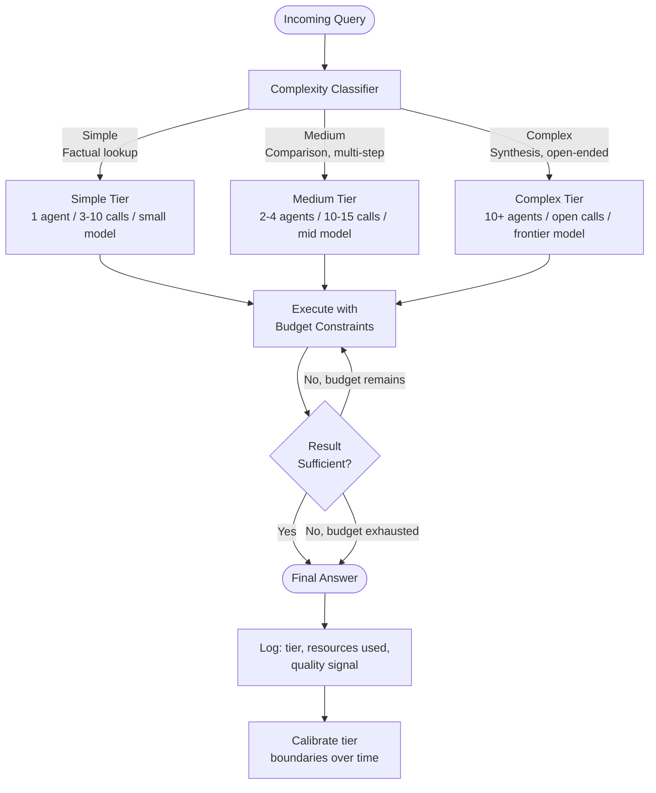

## What It Is

Effort Scaling is a resource allocation pattern that maps query complexity to appropriate computational resources before execution begins. Instead of applying uniform resources to all queries (e.g., always spawning 5 agents, always using the largest model), the system classifies incoming queries into complexity tiers and assigns tier-specific budgets for: number of agents, tool calls per agent, model selection, retrieval depth, and token allocation. This ensures simple queries complete quickly and cheaply while complex queries receive the resources needed for quality results.

## The Problem It Solves

Uniform resource allocation creates a mismatch between task complexity and cost. Without effort scaling, you face:

- **Overinvestment on simple queries** — A factual lookup like "what is the capital of France?" spawns 10 research agents, makes 50 tool calls, and burns $0.50 when a single model call costing $0.001 would have sufficed
- **Underinvestment on complex queries** — A multi-faceted analysis requiring synthesis of 20 sources is allocated the same single-agent, 5-tool-call budget as the simple query, producing superficial results that miss critical context
- **Cost unpredictability** — Without tiers, every query's cost is unknown until execution completes, making budgeting and rate limiting impractical
- **Latency variance** — Simple queries take as long as complex ones because they go through the same expensive pipeline, harming user experience and throughput

## How It Works

1. **Complexity classification** — Analyze the incoming query using heuristics (word count, question structure, entity count) and/or a lightweight classifier (small LM or ML model) to assign a complexity tier: simple, medium, complex.

2. **Tier-to-resource mapping** — Each tier maps to a predefined resource budget:
   - **Simple:** 1 agent, 3-10 tool calls, small model, narrow retrieval
   - **Medium:** 2-4 agents, 10-15 tool calls each, mid-size model, moderate retrieval
   - **Complex:** 10+ agents, open-ended tool calls, frontier model, deep retrieval

3. **Budget enforcement** — The execution system receives the budget as constraints. Agents are instructed to stop after N tool calls; the orchestrator spawns at most M agents; retrieval depth is capped at K sources.

4. **Early termination on sufficiency** — Even within a tier, execution can terminate early if the system judges results sufficient (e.g., a "complex" query that turns out to be answerable with 3 agents stops there, not at 10).

5. **Telemetry and calibration** — Log every query with: predicted tier, actual resources consumed, quality signal (user feedback, LLM-as-Judge score). Use this data to refine tier boundaries and resource allocations over time.



### Example Tier Definitions

| Tier | Query Characteristics | Agent Count | Tool Calls | Model | Retrieval Depth |
|------|----------------------|-------------|------------|-------|-----------------|
| **Simple** | Single fact, definition, calculation, well-defined entity | 1 | 3-10 | Small (Haiku, GPT-3.5) | 1-3 sources |
| **Medium** | Comparison, multi-step reasoning, recent events, lists | 2-4 | 10-15 each | Mid (Sonnet, GPT-4o) | 5-10 sources |
| **Complex** | Synthesis, competitive analysis, multi-domain, open-ended research | 10+ | Open (with outer limit) | Frontier (Opus, o1) | 20+ sources |

## When to Use It

- Multi-agent orchestration systems where spawning agents has meaningful cost (token usage, latency, API calls)
- Query workloads with high variance in complexity (mix of factual lookups and deep research)
- Cost sensitivity requires optimizing spend per query, not just per model call
- User tiers with different SLAs (free users get simple-tier budget, paid users get complex-tier)
- You have telemetry showing that a significant fraction of queries are over- or under-resourced

## When NOT to Use It

- **All queries are uniform complexity** — If your application handles only one query type (e.g., always summarize a 10-page document), tiering adds no value
- **Resources are cheap and latency is critical** — If you optimize for speed above cost and can afford to throw maximum resources at every query, effort scaling adds classification overhead for no benefit
- **Single-agent, single-call systems** — If your pipeline is a single model call with no orchestration, there are no resources to scale
- **Complexity classification is unreliable** — If your classifier frequently misclassifies (simple queries marked complex, vice versa), effort scaling degrades both cost and quality
- **You lack usage data** — Effort scaling requires telemetry to calibrate tier boundaries; without historical data, you're guessing at appropriate budgets

## Trade-offs

1. **Cost optimization vs. classification overhead** — Effort scaling reduces wasted resources on simple queries (often 60-80% cost savings on mixed workloads), but adds a classification step at the start of each query. Classification typically costs 10-50ms and $0.0001-0.001 (lightweight classifier or heuristics). This trade-off is profitable when the cost variance between tiers is high (10×+ difference), making the classification investment worthwhile.

2. **Resource efficiency vs. quality risk on underallocation** — Tight budgets on simple queries prevent waste. The risk is that a query misclassified as "simple" gets insufficient resources and produces a shallow answer. This is mitigated by: (1) conservative tier boundaries (when in doubt, upgrade to next tier), (2) early termination with sufficiency checks, (3) user feedback loops to catch underallocation. The trade-off is accepting 5-10% misclassification rate in exchange for 50-70% cost reduction on the majority of queries.

3. **Predictable costs vs. flexibility within tiers** — Fixed tier budgets make cost estimation straightforward: simple queries cost $X, complex cost $Y. The trade-off is that you lose fine-grained optimization within a tier — all "complex" queries pay the same even if some could have finished earlier. Hybrid approaches (tiers set an *outer limit*, but early termination is allowed) balance predictability with efficiency.

4. **Static rules vs. learned classification** — Heuristic-based classification (word count, keyword matching) is simple and interpretable but brittle. Learned classifiers (small LM fine-tuned on historical query→resource pairs) are more accurate but opaque and require ongoing training data. Static rules work well early; learned classifiers become worthwhile once you have thousands of labeled queries.

## Failure Modes

| Trigger | Symptom | Mitigation |
|---------|---------|-----------|
| Chronic underallocation | Users repeatedly dissatisfied with answers; quality metrics show "simple" tier underperforming | Review queries marked simple that received low quality scores; widen tier boundaries or add a "medium-simple" intermediate tier |
| Overallocation on simple queries | Costs remain high; analysis shows most "complex" queries finish using <30% of budget | Tighten tier boundaries; add early termination signals; downgrade queries that consistently underutilize budget |
| Classification latency | Classifier itself takes 500ms; negates latency benefit of effort scaling | Use heuristic fast path for obvious cases (e.g., <10 words → simple); run classifier async and start with conservative default; cache classifications for similar queries |
| Tier boundary drift | Original boundaries based on 2023 models; new models shift performance curve; tiers no longer aligned | Re-calibrate tier budgets quarterly using recent telemetry; A/B test new boundaries before deploying |
| Gaming by users | Users learn that longer queries get more resources; pad simple queries with filler text | Classify on semantic complexity (entity count, question structure), not just word count; detect and penalize obvious padding |
| No sufficiency signal | Budget exhausted but result is still incomplete; system doesn't know whether to upgrade tier retroactively | Implement LLM-as-Judge or structured output with confidence score; on low confidence + exhausted budget, log for tier recalibration |

## Implementation Example

```python
from anthropic import Anthropic
from typing import Dict, Any
import re

class EffortScaler:
    """Classify queries and allocate resources by complexity tier."""
    
    def __init__(self):
        # Define tier budgets
        self.tiers = {
            "simple": {
                "agent_count": 1,
                "tool_call_limit": 10,
                "model": "claude-haiku-4",
                "retrieval_depth": 3
            },
            "medium": {
                "agent_count": 3,
                "tool_call_limit": 15,
                "model": "claude-sonnet-4",
                "retrieval_depth": 8
            },
            "complex": {
                "agent_count": 10,
                "tool_call_limit": 50,
                "model": "claude-opus-4",
                "retrieval_depth": 20
            }
        }
    
    def classify_query(self, query: str) -> str:
        """Classify query complexity using heuristics."""
        query_lower = query.lower()
        word_count = len(query.split())
        
        # Simple: short factual questions
        if word_count < 10 and any(q in query_lower for q in ["what is", "who is", "when", "where"]):
            return "simple"
        
        # Complex: synthesis, comparison, multi-step, open-ended
        complex_indicators = [
            "compare", "analyze", "synthesize", "comprehensive", "detailed analysis",
            "research", "investigate", "explore in depth", "multiple perspectives"
        ]
        if any(ind in query_lower for ind in complex_indicators):
            return "complex"
        
        # Medium: everything else or moderate length
        return "medium"
    
    def get_budget(self, tier: str) -> Dict[str, Any]:
        """Retrieve resource budget for a tier."""
        return self.tiers.get(tier, self.tiers["medium"])
    
    def execute_with_budget(self, query: str, client: Anthropic) -> str:
        """Execute query with appropriate resource allocation."""
        # Classify
        tier = self.classify_query(query)
        budget = self.get_budget(tier)
        
        print(f"🎯 Query classified as: {tier}")
        print(f"📊 Budget: {budget['agent_count']} agents, "
              f"{budget['tool_call_limit']} tool calls, "
              f"model={budget['model']}")
        
        # Execute with budget constraints (simplified single-agent example)
        response = client.messages.create(
            model=budget["model"],
            max_tokens=2000,
            system=f"You have a budget of {budget['tool_call_limit']} tool calls. "
                   f"Use resources efficiently. For simple queries, answer directly without tools if possible.",
            messages=[{"role": "user", "content": query}]
        )
        
        result = response.content[0].text
        
        # Log for calibration (in production: send to analytics)
        print(f"📈 Completed with tier={tier}, "
              f"tokens={response.usage.input_tokens + response.usage.output_tokens}")
        
        return result


# Usage
client = Anthropic(api_key="your-api-key")
scaler = EffortScaler()

# Simple query: gets minimal resources
simple = scaler.execute_with_budget(
    "What is the capital of France?",
    client
)
print(f"Simple result: {simple}\n")

# Complex query: gets maximum resources
complex_query = scaler.execute_with_budget(
    "Compare the architectural approaches of GPT-4 and Claude 3 for long-context handling, "
    "analyze trade-offs, and synthesize insights from academic papers and engineering blogs.",
    client
)
print(f"Complex result: {complex_query[:200]}...")


# Advanced: Learned classifier using embeddings
class LearnedEffortScaler(EffortScaler):
    """Effort scaler using embedding similarity to historical queries."""
    
    def __init__(self, client: Anthropic):
        super().__init__()
        self.client = client
        # In production: load from database of (query, actual_tier) pairs
        self.reference_queries = {
            "simple": ["What is X?", "Who invented Y?", "When did Z happen?"],
            "medium": ["How does X compare to Y?", "List the main types of Z"],
            "complex": ["Analyze the impact of X on Y", "Synthesize research on Z"]
        }
    
    def classify_query(self, query: str) -> str:
        """Classify using embedding similarity to reference queries."""
        # In production: compute embedding and find nearest neighbors in vector DB
        # For demo, fall back to heuristic
        return super().classify_query(query)
```

## Tool Landscape

**Query routing and resource allocation:**
- OpenAI Model Router — routes by complexity to appropriate model tier
- Anthropic Prompt Caching — automatically caches expensive prompt prefixes
- LangChain Routing — conditional chains based on query classification
- LlamaIndex Query Routing — route to appropriate index or retrieval depth

**Cost and resource monitoring:**
- Helicone — track cost per query with custom tags for tiers
- LangSmith — visualize resource usage by query type
- Weights & Biases Weave — cost tracking with tier labels
- Portkey — LLM gateway with cost controls and routing

**Workload classification:**
- Cohere Classify — fine-tune classifiers for query complexity
- OpenAI Embeddings — semantic similarity for query routing
- Anthropic Claude for classification — use small model to classify before routing

**Multi-agent orchestration (where effort scaling applies):**
- Anthropic Research feature — explicit effort scaling with 1-10+ agent tiers
- OpenAI Agents SDK — manager-as-tool pattern with configurable worker count
- LangGraph — conditional edges for resource allocation based on state

## Further Reading

1. [How we built our multi-agent research system — Anthropic Engineering Blog, June 2025](https://www.anthropic.com/engineering/multi-agent-research-system) — Effort scaling in production (1-10+ agents)
2. [The Economics of Large Language Models — Huyen Chip, 2023](https://huyenchip.com/2023/04/11/llm-engineering.html) — Cost optimization strategies
3. [Optimizing LLM Inference at Scale — Anyscale, 2024](https://www.anyscale.com/blog/optimizing-llm-inference) — Dynamic batching and resource allocation
4. [Query Understanding and Intent Classification — Google Research, 2020](https://research.google/pubs/pub49268/) — Query complexity classification techniques
