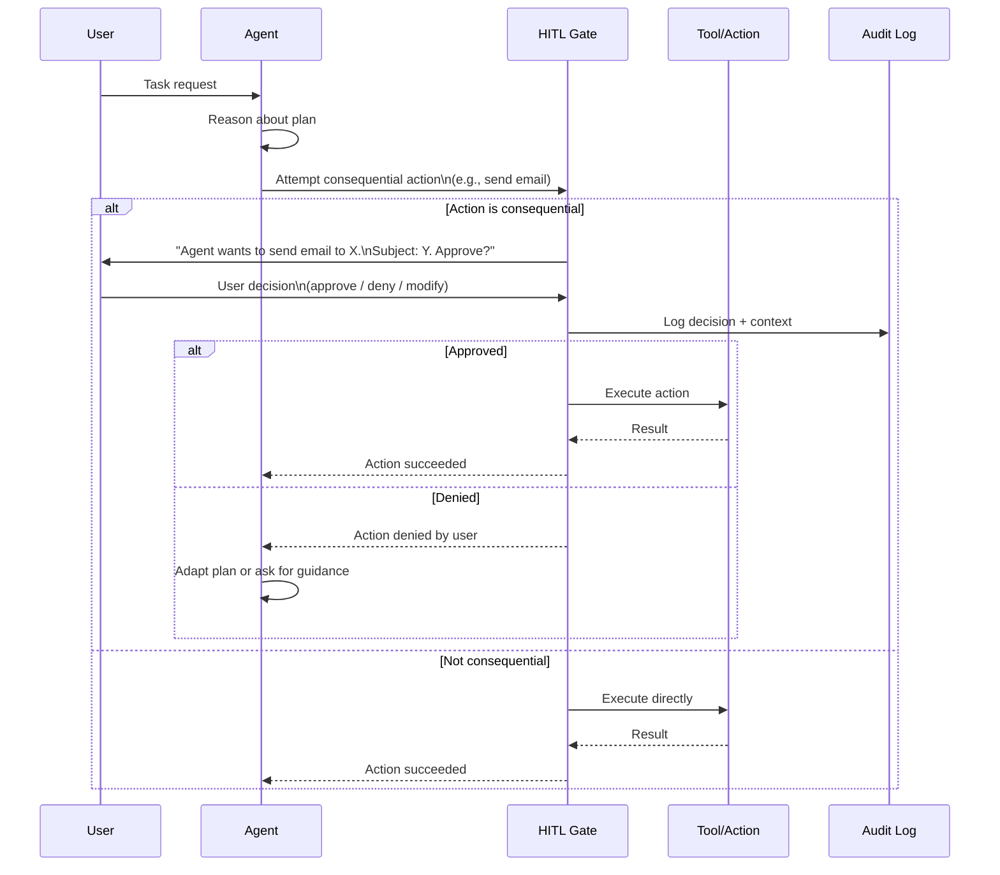

## What It Is

Human-in-the-Loop (HITL) is a governance pattern that pauses agent execution before consequential actions and requests explicit user confirmation. The system defines a set of action categories that require human approval (e.g., sending emails, modifying data, making API calls with side effects), enforces these gates at the infrastructure level, and does not permit the agent to proceed until the user provides consent. This transforms the agent from an autonomous actor into a supervised assistant with bounded authority.

## The Problem It Solves

Fully autonomous agents operating without human oversight can cause costly, embarrassing, or dangerous failures. Without HITL gates, you face:

- **Irreversible errors** — Agents delete files, send emails to wrong recipients, make unauthorized API calls, or modify production data based on misunderstood instructions or hallucinated context
- **Runaway costs** — An agent stuck in a tool-call loop spawns hundreds of expensive API calls before anyone notices, or launches cloud resources that accrue charges indefinitely
- **Compliance violations** — Agents access sensitive data or perform regulated actions (financial transactions, healthcare records access) without proper authorization audit trails
- **User trust erosion** — A single high-profile agent mistake (sending a message to the wrong person, deleting important content) destroys user confidence in the entire system

## How It Works

1. **Action classification** — Define categories of actions as "consequential" based on criteria: irreversibility (cannot be undone), external effects (visible to others), cost thresholds (>$X or >N API calls), or regulatory requirements (requires audit trail).

2. **Infrastructure-level gate** — Implement HITL checkpoints at the tool execution layer, not in the model prompt. When an agent attempts to invoke a classified action, the system intercepts the call before execution.

3. **User notification** — Present the proposed action to the user with context: what the agent wants to do, why (based on its reasoning), what the consequences will be, and what alternatives exist (if any).

4. **Explicit confirmation required** — The user must explicitly approve (yes/no) or provide a modified instruction. The system does not proceed on timeout or default to approval.

5. **Permission persistence (optional)** — For repeated actions within a session, offer users the option to grant one-time vs. persistent permission (e.g., "allow all file writes for this task" vs. "ask each time").

6. **Action execution or alternative path** — On approval, the action executes and the agent continues. On denial, the agent receives a refusal signal and must adapt its plan (try a different tool, ask the user for guidance, or terminate gracefully).



## When to Use It

- Agents have access to tools with external side effects: sending messages, modifying databases, making purchases, deploying infrastructure
- Irreversible actions are possible: deleting data, publishing content publicly, making financial transactions
- Regulatory or compliance requirements mandate human oversight: healthcare (HIPAA), finance (SOX), data privacy (GDPR right to human review)
- Agent reliability is not yet production-grade: early deployments where hallucination rates or tool-use errors remain significant
- User trust is fragile: new product categories where a single mistake will cause users to abandon the system entirely
- Cost runaway risk exists: tools that can spawn expensive resources or make repeated billable API calls

## When NOT to Use It

- **Latency is critical and actions are low-risk** — If the agent performs benign actions (searching, reading, summarizing) where delays hurt UX and mistakes are trivial, HITL adds friction for no benefit
- **Actions are fully reversible and low-cost** — If every action can be undone easily (e.g., draft creation, local file edits with version control), requiring approval on every step makes the system unusable
- **Batch or background processing** — If the agent runs unattended (e.g., overnight data pipeline, scheduled report generation), HITL breaks the workflow since no human is present to approve
- **High-frequency, repetitive actions** — If the agent must make hundreds of similar decisions (e.g., tagging images, approving routine transactions), per-action approval is impractical; use statistical sampling or batch approval instead
- **The action is non-consequential** — Read-only queries, retrieving public data, generating drafts that are not published — these do not require HITL

## Trade-offs

1. **Safety and compliance vs. latency and friction** — HITL prevents catastrophic mistakes and creates audit trails for compliance. The cost is that every consequential action now requires a human round-trip, adding seconds to minutes of delay. For systems where errors are expensive (financial, healthcare, legal), this trade-off is mandatory. For low-risk applications (personal productivity, creative tools), HITL can make the system feel slow and tedious.

2. **Infrastructure enforcement vs. prompt-based requests** — Implementing HITL at the tool execution layer (intercepting API calls before they execute) is robust: even a jailbroken or misbehaving model cannot bypass it. The cost is engineering complexity: you must instrument every tool, maintain a permission model, and handle approval workflows. Prompt-based HITL (asking the model to request confirmation) is simpler to implement but vulnerable: a sufficiently capable model reasoning "this is urgent, I should proceed" can override the rule.

3. **Granular control vs. user fatigue** — Fine-grained permissions (approve every email, every file write, every API call) give users maximum control. The trade-off is approval fatigue: users start clicking "yes" without reading, defeating the safety purpose. Coarse-grained permissions (approve all file writes for this session) reduce fatigue but increase blast radius if the user mistakenly grants broad access.

4. **Session-scoped vs. permanent permissions** — Allowing users to grant persistent permissions (e.g., "always allow this agent to send Slack messages") reduces friction across sessions. The risk is that users forget they granted broad access, or their threat model changes (e.g., a malicious prompt injection occurs weeks later) and the stale permission is still active. Session-scoped permissions are safer but require re-approval on every new conversation.

## Failure Modes

| Trigger | Symptom | Mitigation |
|---------|---------|-----------|
| Overly broad "consequential" classification | Every action requires approval; users abandon the agent due to excessive friction | Classify only truly irreversible or high-impact actions as consequential; allow undo/rollback for lower-risk actions instead of blocking them |
| User confusion at approval prompts | Users don't understand what they're approving; click yes without reading | Provide clear context: what will happen, why the agent needs this, what the alternatives are; show a preview of consequences |
| Approval fatigue | Users approve actions reflexively after seeing many prompts; safety gate becomes security theater | Batch similar actions for single approval ("approve 5 file writes?"); use session-scoped permissions for repeated tasks |
| Agent stalls on denial | User denies action; agent has no fallback plan and terminates or retries infinitely | Train agent to ask for guidance on denial ("I can't send the email. Should I save a draft instead?"); implement max-retry limits |
| Permission creep | Users grant permanent permissions broadly; over time the agent accumulates excessive authority | Default to session-scoped permissions; periodically re-prompt users to review and revoke stale grants |
| No audit trail | Actions are approved but not logged; compliance teams cannot reconstruct what happened or who approved it | Log every approval/denial with: timestamp, user ID, agent ID, action details, and user's decision; retain for compliance period |

## Implementation Example

```python
from anthropic import Anthropic
from typing import Callable, Dict, Any
import json

class HITLGate:
    """Human-in-the-Loop gate for consequential actions."""
    
    def __init__(self):
        self.consequential_actions = {
            "send_email", "delete_file", "make_payment", "publish_content"
        }
        self.session_approvals = {}  # Track session-scoped permissions
    
    def is_consequential(self, tool_name: str) -> bool:
        """Check if this action requires human approval."""
        return tool_name in self.consequential_actions
    
    def request_approval(self, tool_name: str, arguments: Dict[str, Any]) -> bool:
        """Present action to user and request approval."""
        print(f"\n⚠️  APPROVAL REQUIRED")
        print(f"Action: {tool_name}")
        print(f"Arguments: {json.dumps(arguments, indent=2)}")
        print("\nOptions:")
        print("  1. Approve (just this once)")
        print("  2. Approve (for this entire session)")
        print("  3. Deny")
        
        choice = input("\nYour choice (1/2/3): ").strip()
        
        if choice == "1":
            print("✅ Action approved (one-time)")
            return True
        elif choice == "2":
            self.session_approvals[tool_name] = True
            print(f"✅ Action approved (session-wide for {tool_name})")
            return True
        else:
            print("❌ Action denied")
            return False
    
    def execute_with_gate(self, tool_name: str, arguments: Dict[str, Any], 
                         tool_impl: Callable) -> Any:
        """Execute tool with HITL gate if consequential."""
        # Check if we have session-wide approval
        if tool_name in self.session_approvals:
            print(f"✓ Using session approval for {tool_name}")
            return tool_impl(**arguments)
        
        # Check if action is consequential
        if self.is_consequential(tool_name):
            approved = self.request_approval(tool_name, arguments)
            if not approved:
                raise PermissionError(f"User denied action: {tool_name}")
        
        # Execute the action
        return tool_impl(**arguments)


# Example tool implementations
def send_email(to: str, subject: str, body: str) -> str:
    """Simulate sending an email (consequential action)."""
    print(f"📧 Sending email to {to}...")
    return f"Email sent to {to}"

def search_documents(query: str) -> str:
    """Search documents (non-consequential action)."""
    print(f"🔍 Searching for: {query}")
    return f"Found 3 documents matching '{query}'"


# Agent with HITL
class SafeAgent:
    def __init__(self, client: Anthropic):
        self.client = client
        self.gate = HITLGate()
        self.tools = {
            "send_email": send_email,
            "search_documents": search_documents
        }
    
    def execute_tool(self, tool_name: str, arguments: Dict) -> str:
        """Execute a tool through the HITL gate."""
        tool_impl = self.tools.get(tool_name)
        if not tool_impl:
            return f"Error: Unknown tool {tool_name}"
        
        try:
            result = self.gate.execute_with_gate(tool_name, arguments, tool_impl)
            return str(result)
        except PermissionError as e:
            return f"Action denied by user: {e}"
    
    def run(self, user_request: str) -> str:
        """Run agent with HITL protection."""
        # Simplified: In production, this would be a full agent loop
        print(f"\n🤖 Agent processing: {user_request}")
        
        # Simulate agent deciding to send email
        if "send" in user_request.lower() and "email" in user_request.lower():
            result = self.execute_tool("send_email", {
                "to": "user@example.com",
                "subject": "Hello",
                "body": "This is a test email"
            })
            return result
        else:
            result = self.execute_tool("search_documents", {"query": user_request})
            return result


# Usage
client = Anthropic(api_key="your-api-key")
agent = SafeAgent(client)

# Non-consequential action: executes immediately
agent.run("search for quarterly reports")

# Consequential action: requires approval
agent.run("send email to the team")
```

## Tool Landscape

**Agent frameworks with built-in HITL:**
- Anthropic Model Context Protocol (MCP) — one-time vs. permanent permission grants per tool
- OpenAI Agents SDK — output guardrails can block and request human review
- LangChain — human-in-the-loop tool wrappers and approval callbacks
- AutoGen (Microsoft) — `UserProxyAgent` pattern for human approval

**Enterprise governance platforms:**
- Microsoft Copilot Studio — admin-defined action approval policies
- Salesforce Einstein — human review queues for high-impact agent actions
- Google Vertex AI — Model Monitoring with human review triggers

**Workflow and approval systems:**
- Temporal — durable workflow with human approval steps
- Inngest — event-driven functions with manual approval gates
- AWS Step Functions — human approval tasks in state machines

**Audit and compliance logging:**
- Vanta — compliance evidence collection for agent actions
- Drata — automated audit trail capture with human approval records
- OneTrust — consent management and audit workflows

## Further Reading

1. [Our framework for developing safe and trustworthy agents — Anthropic, August 2025](https://www.anthropic.com/news/our-framework-for-developing-safe-and-trustworthy-agents)
2. [Human-in-the-Loop Machine Learning — Monarch, 2021](https://www.manning.com/books/human-in-the-loop-machine-learning)
3. [Model Context Protocol — Permissions and Safety, Anthropic 2024](https://modelcontextprotocol.io/docs/concepts/permissions)
4. [OpenAI Agents SDK Guardrails Documentation, 2025](https://platform.openai.com/docs/agents/guardrails)
