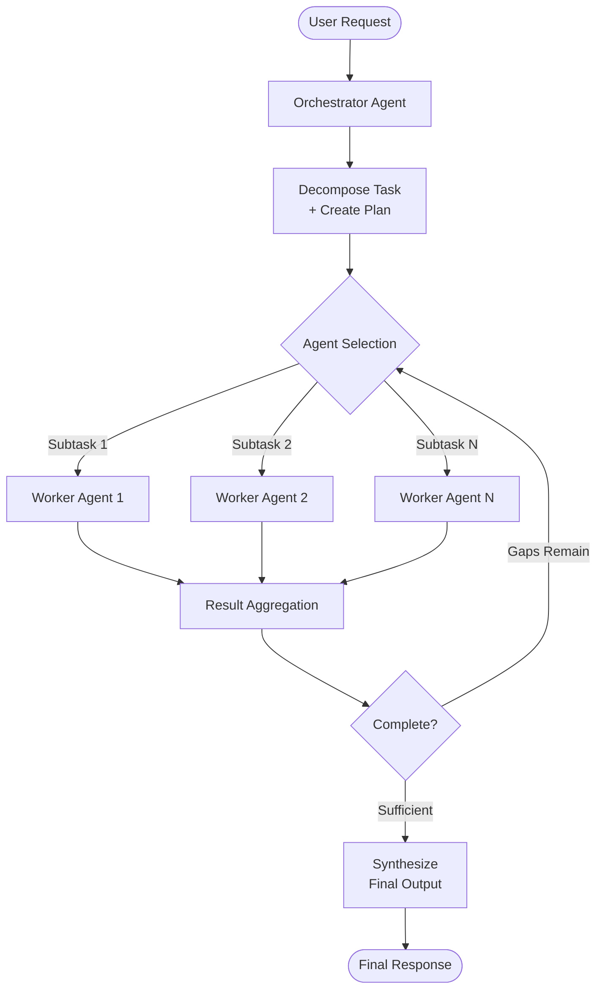

## What It Is

Multi-Agent Orchestration is a coordination pattern where a primary orchestrator agent decomposes complex tasks and delegates subtasks to specialized worker agents, managing the flow of execution, context, and results between them. The orchestrator maintains the overall plan and decision-making authority while workers execute focused, bounded tasks in parallel or sequence.

## The Problem It Solves

Single-agent systems fail when tasks require both breadth (many parallel subtasks) and depth (specialized expertise per subtask). Without orchestration, you face: 

- **Context window exhaustion** — A single agent trying to handle all subtasks fills its context with tool outputs and intermediate results, losing critical plan state mid-execution
- **Expertise dilution** — General-purpose models lack the fine-tuned knowledge or specialized prompting that focused agents provide for domain-specific tasks
- **Coordination collapse** — Without explicit delegation protocols, ad-hoc multi-agent systems produce duplicate work, miss subtasks entirely, or allow agents to interfere with each other's progress
- **Cost explosion** — Routing every subtask through a frontier model, even trivial ones, makes complex workflows economically unviable at scale

## How It Works

1. **Task decomposition** — The orchestrator analyzes the user's request and develops a plan, breaking it into discrete, bounded subtasks with clear success criteria
2. **Agent selection** — For each subtask, the orchestrator selects an appropriate specialist agent (or reuses itself) based on required capabilities, cost constraints, and latency budget
3. **Delegation with context scoping** — The orchestrator delegates each subtask with explicit boundaries: objective, expected output format, tools available, and explicit exclusions to prevent overlap with sibling subtasks
4. **Parallel or sequential execution** — Worker agents execute in isolated contexts, either in parallel (for independent tasks) or sequentially (for dependent chains)
5. **Result aggregation** — Workers return condensed findings to the orchestrator, which synthesizes results and decides whether to spawn additional research rounds or terminate
6. **Iteration or completion** — The orchestrator evaluates completeness, spawns follow-up subtasks if gaps remain, or produces the final output



### Coordination Patterns

Two primary delegation patterns exist:

**Handoff (decentralized control)** — The orchestrator transfers ownership entirely to a specialist. The specialist owns the next response and may further delegate. Control returns only if the specialist explicitly hands back. Best for: open-ended conversation routing, customer service triage, domain-specific consultations.

**Manager-as-Tool (centralized control)** — The orchestrator calls specialists as function tools. Specialists execute and return results, but the orchestrator retains context and control. Best for: document pipelines, data enrichment, structured analysis where a single thread of control must be maintained.

## When to Use It

- Queries require both parallel breadth (researching 10 sources simultaneously) and depth (specialized analysis per source)
- Task complexity exceeds a single agent's context window capacity even with compression
- Subtasks demand specialized expertise, fine-tuned models, or domain-specific tools that a generalist cannot efficiently provide
- Cost optimization requires routing trivial subtasks to small models while reserving frontier models for synthesis
- Latency requirements permit parallel execution of independent subtasks
- The task has clear decomposition boundaries and success criteria for subtasks

## When NOT to Use It

- **Single-pass queries suffice** — Simple factual lookups, straightforward document summarization, or queries answerable with one retrieval pass do not justify orchestration overhead
- **Latency is paramount** — Multi-agent systems add coordination overhead; a single fast model may beat multiple slower delegations
- **Subtasks are tightly coupled** — If every subtask depends on all prior results, parallelism provides no benefit and orchestration just adds cost
- **You lack clear decomposition rules** — If you cannot articulate explicit subtask boundaries, the orchestrator will produce vague delegations that cause coordination collapse
- **Token economics don't justify it** — Multi-agent systems can use 10-15× more tokens than single-agent flows; ensure task value justifies the cost

## Trade-offs

1. **Token cost multiplier vs. task throughput** — Multi-agent orchestration uses substantially more tokens (often 10-15× a single-agent baseline) because each agent operates in its own context window. You pay for breadth: the ability to process more sources, explore more angles, and handle more complex synthesis. This only makes economic sense when the task value exceeds the multiplied cost — typically when a human would otherwise spend hours on the research themselves.

2. **Coordination overhead vs. parallelism gains** — Adding orchestration layers increases end-to-end latency due to delegation handoffs, result serialization, and synthesis steps. The benefit is that independent subtasks can run in parallel, potentially reducing wall-clock time despite higher per-agent latency. If subtasks are sequential dependencies, orchestration just adds cost with no latency benefit.

3. **Complexity in debugging vs. modularity in design** — Multi-agent systems distribute logic across multiple contexts, making failure attribution harder without comprehensive tracing. The benefit is that each agent can be tested, prompted, and optimized independently. Single-agent systems are easier to debug but become unmaintainable as task complexity grows.

4. **Specialist quality vs. generalist flexibility** — Dedicated specialist agents (fine-tuned models, focused prompts, curated tool sets) outperform generalists on narrow tasks. The trade-off is that specialists cannot gracefully handle out-of-scope inputs. The orchestrator must route accurately, or specialist failures cascade.

## Failure Modes

| Trigger | Symptom | Mitigation |
|---------|---------|-----------|
| Vague delegation instructions | Workers produce overlapping or off-target results; duplicate effort across agents | Write explicit task boundaries in delegation: "focus on X, explicitly exclude Y"; include expected output format |
| Orchestrator context overflow | Plan state lost mid-execution; orchestrator forgets early subtask results when synthesizing | Write plan to external memory/state store before spawning workers; workers return condensed findings, not raw outputs |
| Routing miscalibration | Simple queries spawn 10 agents; complex queries under-resourced | Embed explicit effort-scaling rules in orchestrator prompt (e.g., simple=1 agent, medium=2-4, complex=10+); log routing decisions for post-hoc analysis |
| Worker result explosion | Worker returns megabytes of raw data; orchestrator context fills with unprocessed tool outputs | Instruct workers to condense findings before returning; set token budget limits on worker outputs |
| No termination criteria | Orchestration loop continues indefinitely spawning agents and burning tokens | Define explicit stop conditions in orchestrator prompt (max iterations, quality threshold, token budget limit) |

## Implementation Example

```python
from anthropic import Anthropic
from typing import List, Dict, Any

class OrchestratorAgent:
    def __init__(self, client: Anthropic):
        self.client = client
        self.memory_store = {}  # Persistent plan storage
        
    def decompose_task(self, query: str) -> List[Dict[str, Any]]:
        """Break query into bounded subtasks with explicit scopes."""
        response = self.client.messages.create(
            model="claude-opus-4",
            max_tokens=2000,
            system="You are a research orchestrator. Decompose the query into 2-5 focused subtasks. For each: specify objective, expected output, and explicit exclusions to prevent overlap.",
            messages=[{"role": "user", "content": query}]
        )
        # Parse response into structured subtasks (simplified)
        subtasks = [{"id": i, "objective": obj, "scope": scope} 
                   for i, (obj, scope) in enumerate(self._parse_subtasks(response.content[0].text))]
        
        # Persist plan before spawning agents
        self.memory_store["plan"] = subtasks
        return subtasks
    
    def delegate_to_workers(self, subtasks: List[Dict]) -> List[str]:
        """Execute subtasks in parallel via worker agents."""
        import concurrent.futures
        
        with concurrent.futures.ThreadPoolExecutor(max_workers=5) as executor:
            futures = [executor.submit(self._run_worker, task) for task in subtasks]
            results = [f.result() for f in concurrent.futures.as_completed(futures)]
        
        return results
    
    def _run_worker(self, task: Dict) -> str:
        """Single worker agent execution with condensation."""
        response = self.client.messages.create(
            model="claude-sonnet-4",  # Smaller model for workers
            max_tokens=1500,
            system=f"You are a specialist research agent. Task: {task['objective']}. Scope: {task['scope']}. Return ONLY condensed key findings, not raw data.",
            messages=[{"role": "user", "content": task['objective']}]
        )
        return response.content[0].text
    
    def synthesize(self, results: List[str], original_query: str) -> str:
        """Orchestrator synthesizes worker results into final answer."""
        plan = self.memory_store.get("plan", [])
        synthesis_prompt = f"Original query: {original_query}\n\nWorker findings:\n"
        for i, result in enumerate(results):
            synthesis_prompt += f"\nSubtask {i+1}: {result}\n"
        
        response = self.client.messages.create(
            model="claude-opus-4",
            max_tokens=3000,
            system="Synthesize worker findings into a comprehensive answer. Cite which subtask supports each claim.",
            messages=[{"role": "user", "content": synthesis_prompt}]
        )
        return response.content[0].text
    
    def _parse_subtasks(self, text: str) -> List[tuple]:
        # Simplified parser; production would use structured output
        return [("Research X", "Focus on recent papers"), ("Research Y", "Focus on industry applications")]

# Usage
client = Anthropic(api_key="your-api-key")
orchestrator = OrchestratorAgent(client)

query = "Compare the architectural approaches of GPT-4 and Claude 3 for long-context handling"
subtasks = orchestrator.decompose_task(query)
worker_results = orchestrator.delegate_to_workers(subtasks)
final_answer = orchestrator.synthesize(worker_results, query)

print(final_answer)
```

## Tool Landscape

**Multi-agent frameworks with built-in orchestration:**
- OpenAI Agents SDK — handoff and manager-as-tool primitives, session management
- LangGraph — graph-based orchestration with typed edges and state management
- AutoGen (Microsoft) — conversational agent coordination with group chat patterns
- CrewAI — role-based agent teams with task assignment and delegation

**Orchestration layers for existing agent frameworks:**
- Anthropic Model Context Protocol (MCP) — tool and context sharing across agents
- Semantic Kernel (Microsoft) — planner + plugin orchestration
- LlamaIndex Workflows — DAG-based agent composition

**Observability and tracing for multi-agent systems:**
- LangSmith — trace multi-agent runs with per-agent span visibility
- Weights & Biases Weave — track agent interactions and token usage per subtask
- Arize Phoenix — multi-agent trace visualization and debugging

## Further Reading

1. [How we built our multi-agent research system — Anthropic Engineering Blog, June 2025](https://www.anthropic.com/engineering/multi-agent-research-system)
2. [OpenAI Agents SDK Documentation — Handoffs and Coordination Patterns, 2025](https://platform.openai.com/docs/agents)
3. [AutoGen: Enabling Next-Gen LLM Applications via Multi-Agent Conversation — Microsoft Research, 2023](https://arxiv.org/abs/2308.08155)
4. [LangGraph Documentation — Multi-Agent Workflows, 2024](https://langchain-ai.github.io/langgraph/)
