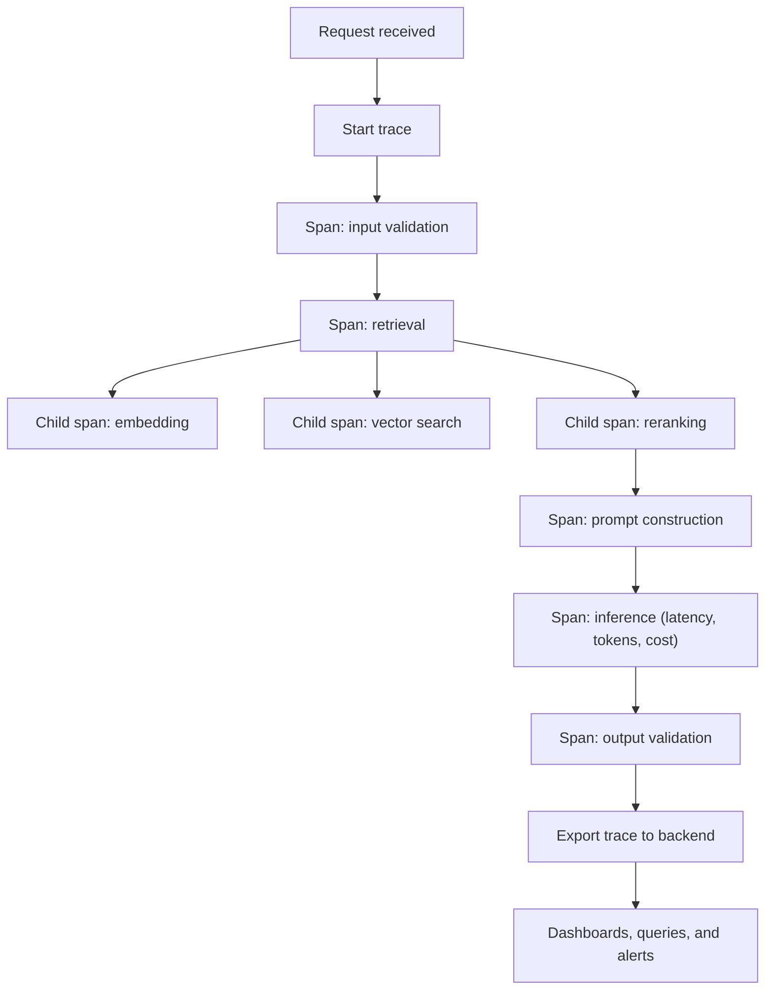

## What It Is

Span-level tracing decomposes every AI pipeline execution into individual spans — retrieval, prompt construction, inference, tool calls, postprocessing — each tagged with timing, token counts, cost, and metadata. It extends OpenTelemetry-style distributed tracing to the specific operations that matter in AI systems.

## The Problem It Solves

When an AI pipeline returns a slow or bad response, the first question is "which step broke?" Without span-level tracing:

- You know total latency but not whether the bottleneck is retrieval, prompt assembly, or inference.
- You know total token count but not how many tokens went to context vs. instructions vs. output.
- You know the final output but not what retrieved context or intermediate reasoning led to it.
- Debugging requires adding print statements, reproducing the issue, and manually stepping through the pipeline.

Traditional APM tools instrument HTTP calls and database queries. They do not instrument prompt construction, retrieval scoring, or token consumption — the operations that dominate AI pipeline performance.

## How It Works



1. Each pipeline execution creates a trace with a unique ID.
2. Every significant operation within the pipeline creates a child span.
3. Spans capture operation-specific attributes: token counts for embedding calls, result counts for retrieval, model name and cost for inference.
4. Spans are nested to show parent-child relationships.
5. Completed traces are exported to a trace backend for visualization, querying, and alerting.
6. Aggregated span metrics enable identifying systemic bottlenecks across many requests.

## When to Use It

- You are running multi-step AI pipelines (RAG, agents, chains) and need to understand per-step performance.
- Latency or cost debugging requires more granularity than request-level metrics provide.
- You need to answer questions like "why was this response slow?" or "which step consumed the most tokens?"
- You are optimizing pipeline performance and need data on where time and tokens are actually spent.

## When NOT to Use It

- Your AI integration is a single, direct LLM API call with no pipeline. A single API call does not benefit from span-level decomposition. Request-level metrics are sufficient.
- You are in early prototyping where the pipeline changes daily. Instrumentation code becomes maintenance overhead that slows iteration. Add tracing when the pipeline stabilizes.
- Your trace backend cannot handle the volume. Each request generates multiple spans. At high throughput, consider sampling rather than skipping tracing entirely.

## Trade-offs

1. **Instrumentation overhead** — Adding span creation and attribute recording to every pipeline step adds code and a small latency overhead (typically sub-millisecond per span).
2. **Storage costs** — Traces are verbose. A single RAG pipeline execution can generate 5-15 spans. At 10,000 requests/day, that is 50,000-150,000 spans/day. Sampling strategies are essential at scale.
3. **Schema maintenance** — As the pipeline evolves, span names and attributes must be kept consistent. Stale or renamed spans create gaps in dashboards and alerts.
4. **Privacy considerations** — Traces may capture prompt content and model outputs. Ensure sensitive data is redacted before export to the trace backend.

## Failure Modes

| Trigger | Symptom | Mitigation |
|---------|---------|-----------|
| Dynamic span names (user ID, query text) | Unbounded unique span types; storage costs spike; dashboards unusable | Enforce fixed span name taxonomy; pass dynamic values as attributes not names |
| Async/parallel pipeline steps not linked | Traces have gaps; child spans missing or orphaned; underreported latency | Explicitly propagate trace context into async workers; test tracing on parallel paths |
| PII in trace attributes (full prompts) | Sensitive user data visible in dashboards/third-party backends | Apply redaction filter in exporter; store only hashes or truncated previews by default |

## Implementation Example

```python
import time
from contextlib import contextmanager
from dataclasses import dataclass, field
from uuid import uuid4


@dataclass
class Span:
    name: str
    trace_id: str
    span_id: str = field(default_factory=lambda: uuid4().hex[:16])
    parent_id: str | None = None
    start_time: float = 0.0
    end_time: float = 0.0
    attributes: dict = field(default_factory=dict)
    children: list["Span"] = field(default_factory=list)

    @property
    def duration_ms(self) -> float:
        return (self.end_time - self.start_time) * 1000


class Tracer:
    def __init__(self):
        self._traces: dict[str, Span] = {}

    @contextmanager
    def start_trace(self, name: str):
        trace_id = uuid4().hex[:32]
        root = Span(name=name, trace_id=trace_id)
        root.start_time = time.monotonic()
        self._traces[trace_id] = root
        ctx = _TraceContext(root_span=root, current_span=root)
        try:
            yield ctx
        finally:
            root.end_time = time.monotonic()

    def get_trace(self, trace_id: str) -> Span | None:
        return self._traces.get(trace_id)


class _TraceContext:
    def __init__(self, root_span: Span, current_span: Span):
        self.root_span = root_span
        self._current = current_span

    @contextmanager
    def span(self, name: str, **attributes):
        child = Span(
            name=name,
            trace_id=self.root_span.trace_id,
            parent_id=self._current.span_id,
            attributes=attributes,
        )
        child.start_time = time.monotonic()
        self._current.children.append(child)
        previous = self._current
        self._current = child
        try:
            yield child
        finally:
            child.end_time = time.monotonic()
            self._current = previous

    def set_attribute(self, key: str, value) -> None:
        self._current.attributes[key] = value


def format_trace(span: Span, indent: int = 0) -> str:
    prefix = "  " * indent
    line = f"{prefix}{span.name}: {span.duration_ms:.1f}ms"
    if span.attributes:
        attrs = ", ".join(f"{k}={v}" for k, v in span.attributes.items())
        line += f" ({attrs})"
    lines = [line]
    for child in span.children:
        lines.append(format_trace(child, indent + 1))
    return "\n".join(lines)


async def traced_rag_pipeline(tracer: Tracer, query: str) -> dict:
    with tracer.start_trace("rag_pipeline") as ctx:
        ctx.set_attribute("query", query)

        with ctx.span("retrieval") as retrieval_span:
            with ctx.span("embedding", model="text-embedding-3-small"):
                query_embedding = await embed(query)
                ctx.set_attribute("tokens", len(query.split()))

            with ctx.span("vector_search"):
                results = await search(query_embedding, top_k=20)
                ctx.set_attribute("candidates", len(results))

            with ctx.span("reranking"):
                reranked = await rerank(query, results, top_k=5)
                ctx.set_attribute("selected", len(reranked))

        with ctx.span("prompt_construction"):
            prompt = build_prompt(query, reranked)
            ctx.set_attribute("token_count", count_tokens(prompt))

        with ctx.span("inference", model="claude-3-5-sonnet") as llm_span:
            response = await generate(prompt)
            ctx.set_attribute("input_tokens", response["usage"]["input_tokens"])
            ctx.set_attribute("output_tokens", response["usage"]["output_tokens"])

        with ctx.span("output_validation"):
            validated = validate_output(response)
            ctx.set_attribute("passed", validated)

        return response
```

For production use, integrate with OpenTelemetry SDKs instead of a custom implementation. The example demonstrates the concept; real systems should use established tracing infrastructure.

## Tool Landscape

**Production tracing platforms for AI:**
- Langfuse — Open-source LLM observability with cost tracking and evaluation
- Arize Phoenix — Open-source traces with embedding drift detection
- Langsmith — Managed platform with deep LangChain integration
- OpenTelemetry + Jaeger — Generic tracing infrastructure adapted for AI
- Datadog LLM Observability — Extends Datadog APM with LLM-specific spans

**Gateway-level tracing:**
- Helicone — Managed proxy for request-level tracing (less granular)
- Braintrust — LLM monitoring with trace collection

## Further Reading

1. [Langfuse Tracing Documentation](https://langfuse.com/docs/tracing)
2. [OpenTelemetry for LLMs — Arize AI](https://docs.arize.com/phoenix/tracing/llm-traces)
3. [Distributed Tracing — OpenTelemetry Concepts](https://opentelemetry.io/docs/concepts/signals/traces/)
4. [Observability for Large Language Models — OTEL Blog, 2024](https://opentelemetry.io/blog/llm-observability/)
5. [Production Observability for AI Agents — Langfuse Blog, 2024](https://langfuse.com/blog/observability-llm-agents)
